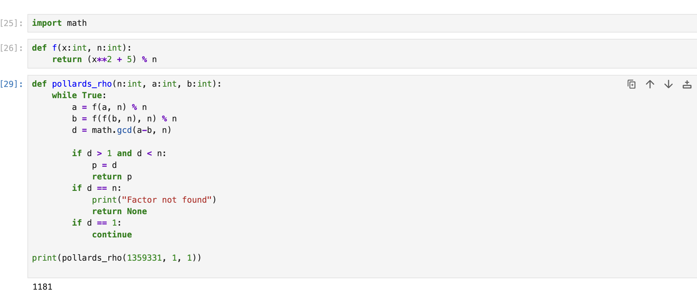

---
## Author
author:
  name: Филибер Никола
  degrees: Магистран
  email: 1132259430@rudn.ru 
  affiliation:
    - name: Российский университет дружбы народов
      country: Российская Федерация
      postal-code: 117198
      city: Москва
      address: ул. Миклухо-Маклая, д. 6

## Title
title: "ЛАБОРАТОРНАЯ РАБОТА Nº6"
subtitle: "Разложение чисел на множители"
license: "CC BY"
---

# Цель работы

Изучение и практическое применение методов программной реализации алгоритма разложения чисел на множители.

# Задание

1. Реализовать Алгоритм ρ-метод Полларда
2. Разложить на множители данное преподавателем число.

# Теоретическое введение

Задача разложения составного числа на множители формулируется следующим образом: для данного положительного целого числа `n` найти его каноническое разложение:

`n = p1^a1 * p2^a2 * ... * ps^as`,

где `pi` — попарно различные простые числа, `ai >= 1`.

На практике не обязательно находить каноническое разложение числа `n`.
Достаточно найти его разложение на два **нетривиальных сомножителя**:

`n = p * q`, где `1 <= p <= q < n`.

Далее будем понимать задачу разложения именно в этом смысле.

Пусть `n` — нечётное составное число,  
`S = {0, 1, ..., n - 1}`  
и `f: S -> S` — случайное отображение, обладающее сжимающими свойствами, например:

`f(x) = x^2 + 1 (mod n)`.

Основная идея метода состоит в следующем. Выбираем случайный элемент `x0 ∈ S` и строим последовательность `x0, x1, x2, ...`, определяемую рекуррентным соотношением:

`x(i+1) = f(xi)`, где `i >= 0`,

до тех пор, пока не найдём такие числа `i, j`, что `i < j` и `xi = xj`.

Поскольку множество `S` конечно, такие индексы существуют (последовательность «зацикливается»).

## Алгоритм, реализующий ρ-метод Полларда

**Вход:** число `n`, начальное значение `c`, функция `f`, обладающая сжимающими свойствами.  
**Выход:** нетривиальный делитель числа `n`.

1. Положить `a <- c`, `b <- c`.
2. Вычислить `a <- f(a) (mod n)`, `b <- f(f(b)) (mod n)`.
3. Найти `d = gcd(a - b, n)`.
4. Если `1 < d < n`, то результат: `d`.  
   Если `d = n`, результат: «Делитель не найден».  
   Если `d = 1`, вернуться на шаг 2.

## Пример

Найти ρ-методом Полларда нетривиальный делитель числа `n = 1359331`.  
Положим `c = 1` и `f(x) = x^2 + 5 (mod n)`.

Работа алгоритма:

| i | a       | b       | d = gcd(a − b, n) |
|---|---------|---------|------------------|
| 1 | 1       | 1       | 1 |
| 2 | 6       | 41      | 1 |
| 3 | 41      | 123939  | 1 |
| 4 | 1686    | 391594  | 1 |
| 5 | 123939  | 438157  | 1 |
| 6 | 435426  | 582738  | 1 |
| 7 | 391594  | 1144026 | 1 |
| 8 | 1090062 | 885749  | 1181 |

Таким образом, `1181` является нетривиальным делителем числа `1359331`.

# Выполнение лабораторной работы

## ρ-метод Полларда

# Выводы

Изученил и разработал методоы программной реализации алгоритма разложения чисел на множители.

# Список литературы{.unnumbered}
https://en.wikipedia.org/wiki/Pollard%27s_rho_algorithm

